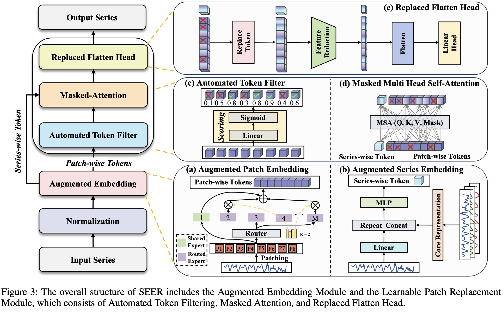
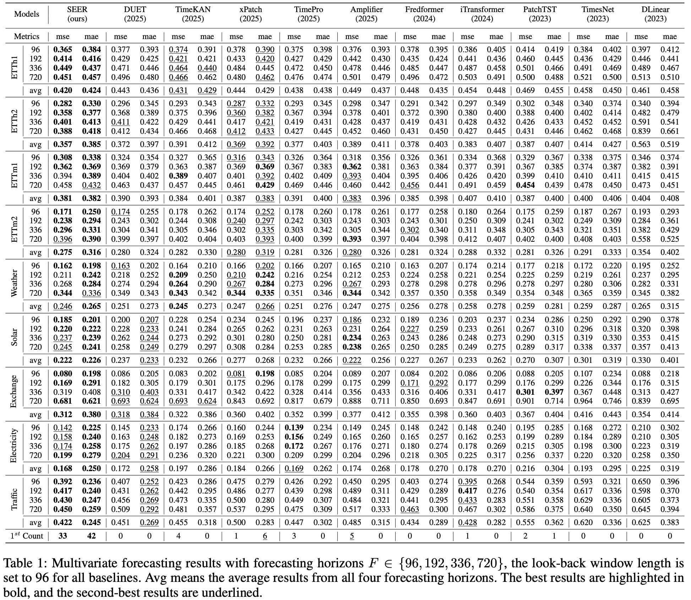

# SEER: Transformer-based Robust Time Series Forecasting via Automated Patch Enhancement and Replacement

[](https://www.python.org/)  [](https://pytorch.org/)

This code is the official PyTorch implementation of our paper SEER: Transformer-based Robust Time Series Forecasting via Automated Patch Enhancement and Replacement.

<div align="center">

</div>


## Quickstart

> [!IMPORTANT]
> this project is fully tested under python 3.8, it is recommended that you set the Python version to 3.8.
1. Requirements

Given a python environment (**note**: this project is fully tested under python 3.8), install the dependencies with the following command:

```shell
pip install -r requirements.txt
```

2. Data preparation

You can obtained the well pre-processed datasets from [Google Drive](https://drive.google.com/file/d/1vgpOmAygokoUt235piWKUjfwao6KwLv7/view?usp=drive_link). Then place the downloaded data under the folder `./dataset`. 

3. Train and evaluate model

- To see the model structure of SEER,  [click here](ts_benchmarkaselines/seer/models/seer_model.py).
- We provide all the experiment scripts for SEER and other baselines under the folder `./scripts/SEER_script`.  For example you can reproduce all the experiment results as the following script:

```shell
sh ./scripts/SEER_script/ETTh1_script/SEER.sh
```

## Results
<div align="center">

</div>
